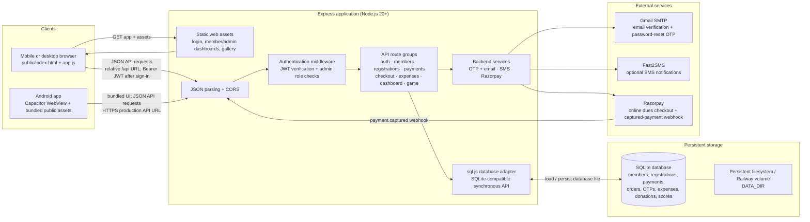
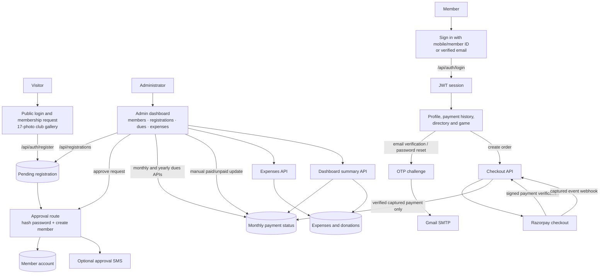
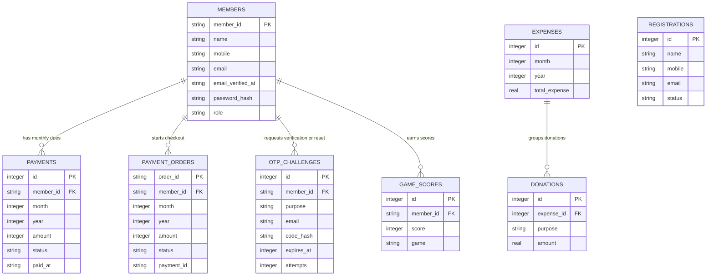

# Brahmastra Club Web App Architecture

This document describes the current web and Android app, its backend, and the main data flows.

## System overview

The Express server serves the browser interface and API from the same application. The Android app bundles the same `public` interface with Capacitor and calls the configured HTTPS production API. Signed-in requests carry a JWT in the `Authorization: Bearer ...` header. Protected routes verify the token; administrative routes also check the user's role.

## Main workflows

Manual admin dues updates only record a status; they do not collect funds. Online member dues are marked paid only after successful server-side verification of a captured Razorpay payment.

## Data model

Registration requests remain in `REGISTRATIONS` until an administrator approves them. Approval creates a row in `MEMBERS` and updates the request status; registrations are not linked by a foreign key to member accounts.

## Repository map

- `public/index.html`, `public/app.js`: single-page interface and API client.
- `server/index.js`: Express startup, CORS, API mounting, and static-file serving.
- `server/routes/`: authentication, member/profile, registration, dues/payment checkout, expenses, dashboard, and game APIs.
- `server/middleware/auth.js`: JWT authentication and administrator authorization.
- `server/services/`: OTP/email, SMS, and Razorpay integrations.
- `server/db.js`: database schema/migrations and the sql.js-backed SQLite adapter.
- `android/` and `capacitor.config.json`: native Android wrapper configuration.

## Runtime and configuration

- Run locally with Node.js 20+, `.env` configured, and `npm start`; the default port is `4000`.
- Local data is stored at `server/data/club.db`. Set `DATA_DIR` to a mounted persistent directory in production.
- Set secrets such as `JWT_SECRET`, `INITIAL_ADMIN_PASSWORD`, email/SMS credentials, and Razorpay credentials in the deployment environment, not source control.
- `public/index.html` selects `/api` for a browser and `https://www.brahmastravakkom.in/api` for a Capacitor native build.
